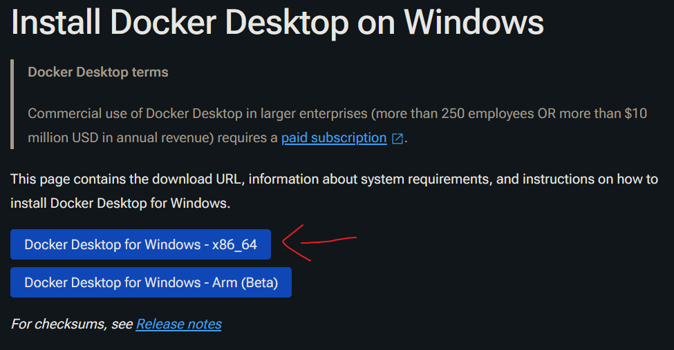
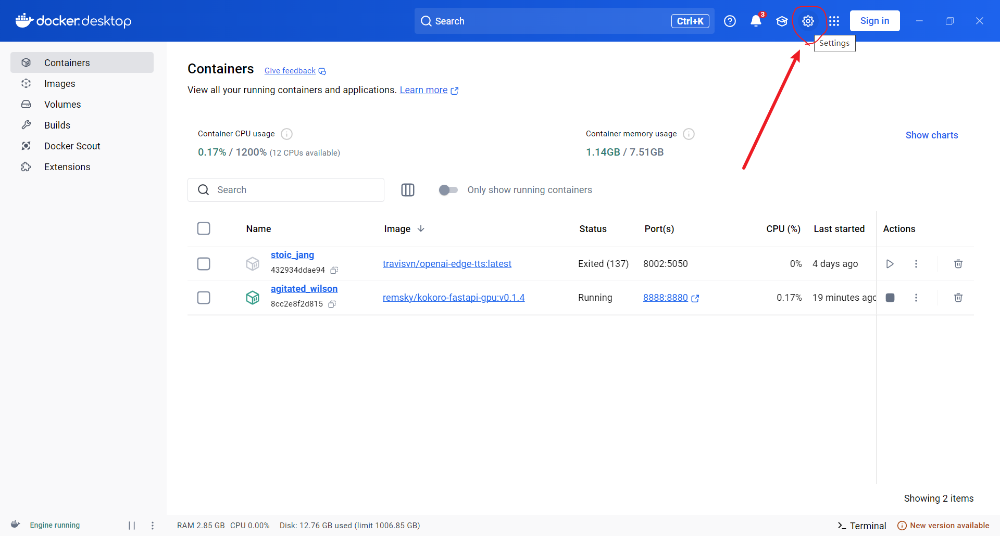
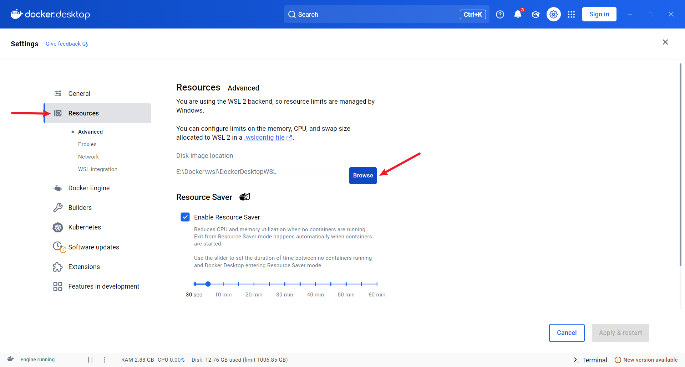
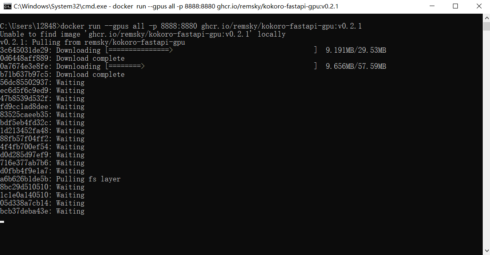
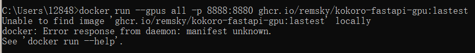
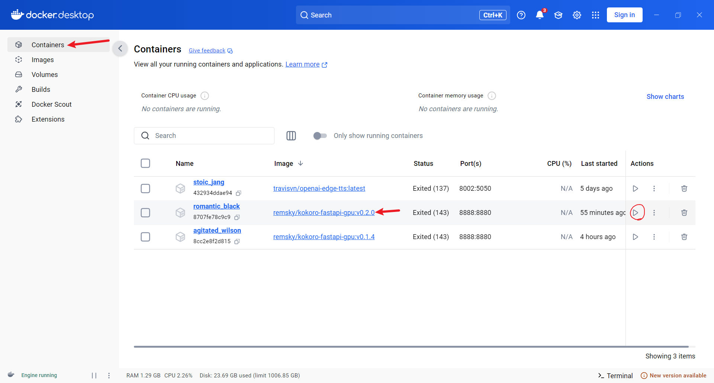
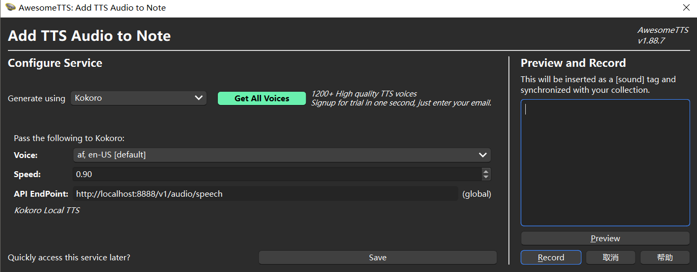
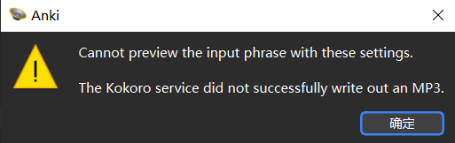
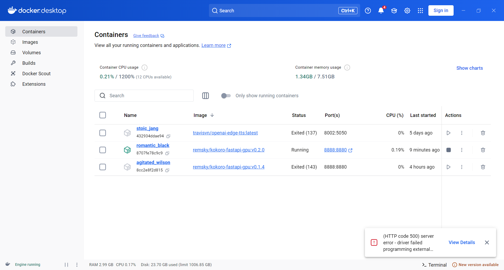
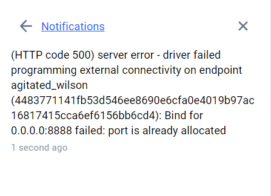

# Model Download(For Everyone)

If you're not familiar with Docker, no worries—there's a detailed tutorial below. To put it simply, what you need to do is download a software called Docker Desktop, and then download the Kokoro model within the software.

1. Go to this [website](https://docs.docker.com/desktop/setup/install/windows-install/), click on the button at the top to download Docker Desktop.



2. (Optional) After the download and installation are complete, it is recommended to go to the Settings interface first and modify the model download location to another drive (the default is to place it on the C drive).





3. Press Win+R on the keyboard, type "cmd" and press Enter, paste one of the following two lines into it, and press Enter to download the model. The first line is for downloading a model that runs only on the CPU, and the second line is for downloading a model that runs on the GPU, which will be much faster. It is recommended to use the second line to download first, and only use the first line if the model doesn't run.

```
docker run -p 8888:8880 ghcr.io/remsky/kokoro-fastapi-cpu:v0.2.0 # CPU, or:
docker run --gpus all -p 8888:8880 ghcr.io/remsky/kokoro-fastapi-gpu:v0.2.0  #NVIDIA GPU
```



If the following errors occur, it indicates that you have not opened Docker Desktop. Please open Docker Desktop first before downloading the model.



4. After the download is successful, go back to Docker Desktop, and you should see an additional running model named ghcr.io/remsky/kokoro-fastapi-gpu:v0.2.0 on the Containers page. If it's not running, click the Start button.



5. Go back to the Anki plugin configuration, enter http://localhost:8888/v1/audio/speech in the API EndPoint field. Do not include any extra spaces.



6. Each time you want to use Kokoro's tts service in Anki, you need to start the Kokoro model in the Docker Desktop, and turn it off when not in use.


# Cautionary Notes

+ At present, Chinese and Japanese voice only supports generating English with Chinese and Japanese accents.
+ If the following error occurs and voice generation is not possible, please check and troubleshoot the issues in the following order:



1. Check if the Kokoro model is open in Docker Desktop
2. Restart Anki and try generating with another Voice

+ If the model fails to start in Docker Desktop and the following error message appears, the only recommended solution I have is to restart the computer.



