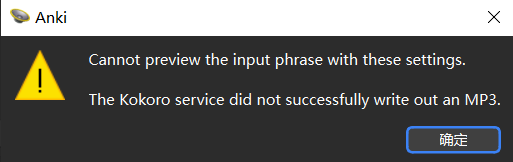

# 介绍

Kokoro TTS是2025年最新的一款轻量级、高性能的文本转语音（TTS）模型，其生成的音频在语气语调上几乎和真人没什么区别，可以试一下[效果](https://huggingface.co/spaces/hexgrad/Kokoro-TTS)。更让我惊喜的是它的模型参数很少，这意味着它能够在家用电脑的普通CPU和GPU上流畅运行。而且支持生成American English、British English、Spanish、French、Hindi、Italian、Japanese、Brazilian Portuguese、Mandarin Chinese。

我之前一直使用AwesomeTTS这个插件来在Anki中生成音频，配置的是有道的tts服务，一直觉得生成的音频质量不够好。于是我在本地安装了[Kokoro TTS模型](https://github.com/remsky/Kokoro-FastAPI)，又在AwesomeTTS的基础上改进，添加了调用本地Kokoro的服务。


# 插件安装

由于AwesomeTTS的作者已经停止更新AwesomeTTS，转而维护他的另一个项目HyperTTS，所以你完全可以毫无后顾之忧地先在Anki插件页面禁用或删除AwesomeTTS插件，然后输入插件代码`903988322`，安装AwesomeTTS-AI-Version(unofficial)。

# 下载模型

安装插件后，你还需要在本地使用Docker下载Kokoro的模型。在命令行输入下面两个命令中的其中一个，然后在插件配置Kokoro访问的API地址即可，默认是`http://localhost:8888/v1/audio/speech`。注意，如果你修改了容器的端口，一定记住要修改API地址中的端口号。

```
docker run -p 8888:8880 ghcr.io/remsky/kokoro-fastapi-cpu:v0.2.0 # CPU, or:
docker run --gpus all -p 8888:8880 ghcr.io/remsky/kokoro-fastapi-gpu:v0.2.0  #NVIDIA GPU
```

# 注意事项

+ 目前的中文和日语语音仅支持生成中国口音和日本口音的英语。
+ 如果出现以下报错，无法生成语音，请按照以下顺序排查问题：



1. 查看Kokoro模型是否在Docker Desktop中打开
2. 重启Anki，选择另一个Voice尝试进行生成

# OpenAI Compatible

另外，我还添加了OpenAI Compatible（OpenAI接口兼容）服务，意味着你自行在本地安装其他OpenAI接口兼容的TTS模型（比如[openai-edge-tts](https://github.com/travisvn/openai-edge-tts)）进行语音生成。

