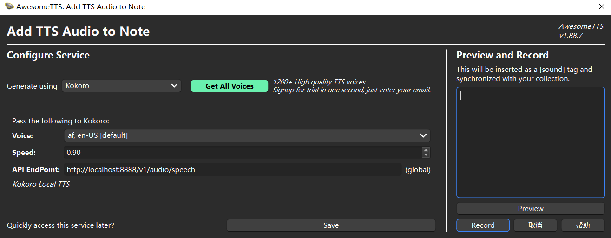

- [ENGLISH](README.md)
- [简体中文](README-CN.md)


# Introduction

Kokoro TTS is the latest lightweight and high-performance text-to-speech (TTS) model for 2025. The generated audio is almost indistinguishable from that of a real person in terms of tone and intonation. You can give it a try at [this link](https://huggingface.co/spaces/hexgrad/Kokoro-TTS). What's even more impressive is that its model parameters are minimal, which means it can run smoothly on a regular CPU and GPU in a home computer. Moreover, it supports generating American English, British English, Spanish, French, Hindi, Italian, Japanese, Brazilian Portuguese, and Mandarin Chinese.

I've been using the AwesomeTTS plugin to generate audio in Anki with the free service, and I've always felt that the quality of the generated audio wasn't up to par. So, I installed the [Kokoro TTS model](https://github.com/remsky/Kokoro-FastAPI) locally, and also made improvements to the AwesomeTTS, adding the ability to call the local Kokoro service.



# Addon Installation

Since the author of AwesomeTTS has stopped updating AwesomeTTS and has shifted to maintaining another project called HyperTTS, you can completely disable or remove the AwesomeTTS plugin from the Anki plugin page without any worries. Then, enter the plugin code `903988322` to install the AwesomeTTS-AI-Version (unofficial).

# Model Download

After installing the plugin, you also need to download Kokoro's model using Docker locally. Enter one of the following two commands in the command line, then configure the plugin to access the Kokoro API address, which is default to `http://localhost:8888/v1/audio/speech`. Note that if you change the container's port, make sure to update the port number in the API address.

```
docker run -p 8888:8880 ghcr.io/remsky/kokoro-fastapi-cpu:v0.2.0 # CPU, or:
docker run --gpus all -p 8888:8880 ghcr.io/remsky/kokoro-fastapi-gpu:v0.2.0  #NVIDIA GPU
```

# Cautionary Notes

+ At present, Chinese and Japanese voice only supports generating English with Chinese and Japanese accents.
+ If the following error occurs and voice generation is not possible, please check and troubleshoot the issues in the following order:


1. Check if the Kokoro model is open in Docker Desktop
2. Restart Anki and try generating with another Voice

# OpenAI Compatible

Additionally, I've added OpenAI Compatible (OpenAI Interface Compatible) service, which means you can install other OpenAI compatible TTS models locally (such as [openai-edge-tts](https://github.com/travisvn/openai-edge-tts)) for tts service.

